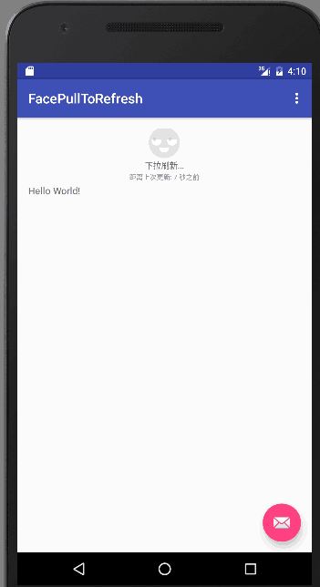
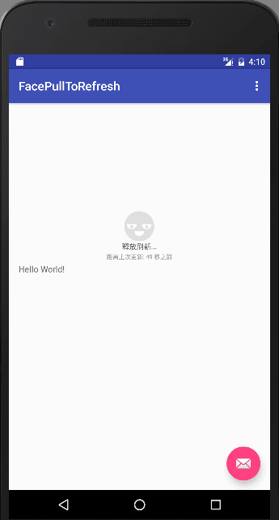
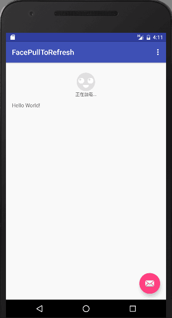

# FacePullToRefresh
基于android-Ultra-Pull-To-Refresh去实现一个笑脸下拉刷新（随header高度变化而缩放、转眼睛）
现在主流app中，下拉刷新都是随着header高度变化而变化（包括google的SwipeRefreshLayout控件效果也是类似如此，具体原理是不一样的，千万不要被误导）！
所以，我也基于android-Ultra-Pull-To-Refresh去实现一个笑脸下拉刷新（随header高度变化而缩放、转眼睛），
刷新过程不断转眼睛的动画！对于自定义View中，操作画布不是很熟悉的同学建议看一下。你也可以很轻松地实现自己想要的效果！！！
（还有，强烈建议同学们去看android-Ultra-Pull-To-Refresh开源库，设计得非常好）

##截图：

##Gradle

compile 'com.linguoding:FacePullToRefresh:1.0.0'

##布局

      <com.pulltorefreshlibrary.FacePullToRefreshLayout
        android:id="@+id/face_pull_to_refresh"
        android:layout_width="match_parent"
        android:layout_height="match_parent">
        <TextView
            android:layout_width="wrap_content"
            android:layout_height="wrap_content"
            android:text="Hello World!"/>
    </com.pulltorefreshlibrary.FacePullToRefreshLayout>

##调用代码：

        facePullToRefreshLayout = (FacePullToRefreshLayout) findViewById(R.id.face_pull_to_refresh);
        facePullToRefreshLayout.setLastUpdateTimeRelateObject(this);
        facePullToRefreshLayout.setRefreshListener(new FacePullToRefreshLayout.RefreshListener() {
            @Override
            public void onRefresh(PtrFrameLayout frame) {
                facePullToRefreshLayout.postDelayed(new Runnable() {
                    @Override
                    public void run() {
                        Log.e(Tag, "刷新...");
                        facePullToRefreshLayout.refreshComplete();
                    }
                }, 3000);
            }
        });    
